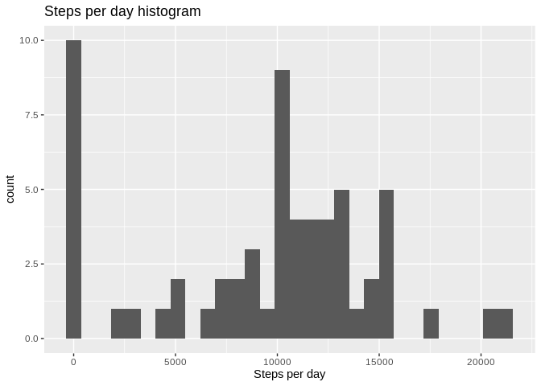
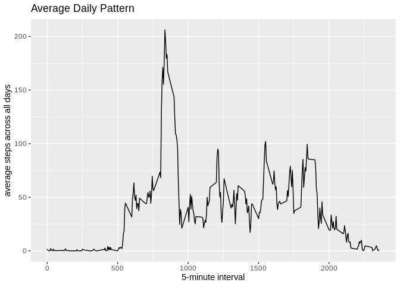
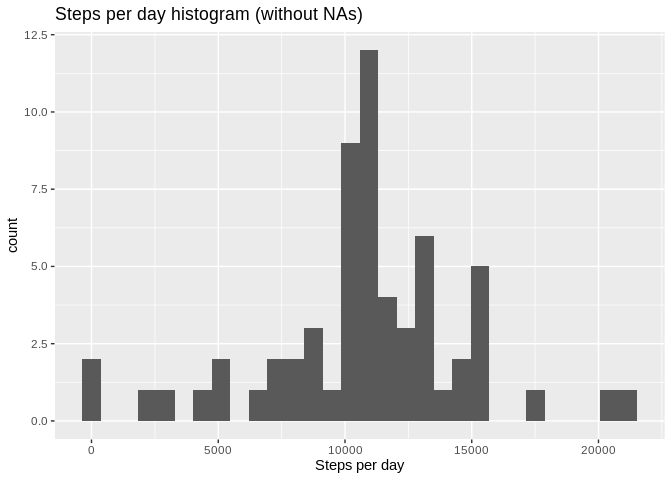
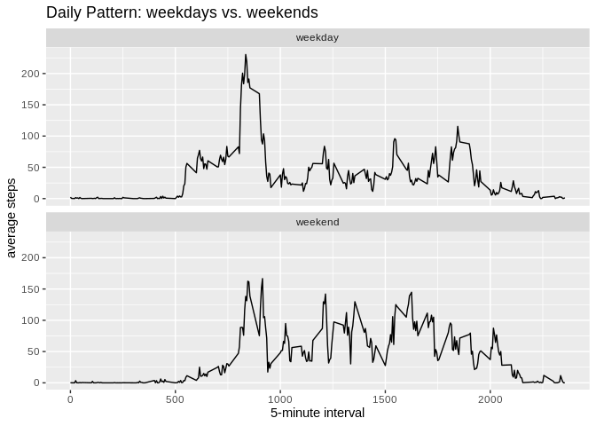

## Loading and preprocessing the data


```r
library(utils)
unzip("activity.zip")
activity <- read.csv("activity.csv")
library(dplyr)
```

```
## 
## Attaching package: 'dplyr'
```

```
## The following objects are masked from 'package:stats':
## 
##     filter, lag
```

```
## The following objects are masked from 'package:base':
## 
##     intersect, setdiff, setequal, union
```

```r
activity <- mutate(activity, hour_min = formatC(interval,digits = 0,width = 4,flag = "0"))
activity <- mutate(activity, dateTime = strptime(paste(date,hour_min), "%Y-%m-%d %H%M"))
str(activity)
```

```
## 'data.frame':	17568 obs. of  5 variables:
##  $ steps   : int  NA NA NA NA NA NA NA NA NA NA ...
##  $ date    : chr  "2012-10-01" "2012-10-01" "2012-10-01" "2012-10-01" ...
##  $ interval: int  0 5 10 15 20 25 30 35 40 45 ...
##  $ hour_min: chr  "0000" "0005" "0010" "0015" ...
##  $ dateTime: POSIXlt, format: "2012-10-01 00:00:00" "2012-10-01 00:05:00" ...
```

## What is mean total number of steps taken per day?

1. Calculate the total number of steps per day

```r
steps_per_day <- activity %>%
    group_by(as.factor(date)) %>%
    summarize(total=sum(steps, na.rm = TRUE)) 
head(steps_per_day)
```

```
## # A tibble: 6 × 2
##   `as.factor(date)` total
##   <fct>             <int>
## 1 2012-10-01            0
## 2 2012-10-02          126
## 3 2012-10-03        11352
## 4 2012-10-04        12116
## 5 2012-10-05        13294
## 6 2012-10-06        15420
```

2. Make a histogram of the total number of steps per day

```r
library(ggplot2)
ggplot(steps_per_day, aes(x=total)) +
    geom_histogram() +
    labs(x= "Steps per day",
      title = "Steps per day histogram")
```

```
## `stat_bin()` using `bins = 30`. Pick better value with `binwidth`.
```

<!-- -->

3. Calculate and report the mean and median of the total number of steps per day
Mean:


```r
mean_steps_day <- mean(steps_per_day$total)
mean_steps_day
```

```
## [1] 9354.23
```
Median:

```r
median_steps_day <- median(steps_per_day$total)
median_steps_day
```

```
## [1] 10395
```

## What is the average daily activity pattern?

1. Make a time series plot (i.e. type = "l") of the 5-minute interval (x-axis) and the average number of steps taken, averaged across all days (y-axis)

```r
daily_activity <- activity %>%
    group_by(interval) %>%
    summarize(mean_steps_5min=mean(steps, na.rm = TRUE))
ggplot(daily_activity, aes(x=interval,y=mean_steps_5min))+
    geom_line() +
        labs(x= "5-minute interval", y="average steps across all days",
      title = "Average Daily Pattern")
```

<!-- -->

2. Which 5-minute interval, on average across all the days in the dataset, contains the maximum number of steps?

* The maximum steps in a 5-minute interval are:

```r
max_steps <- max(daily_activity$mean_steps_5min)
max_steps
```

```
## [1] 206.1698
```

* The 5-minute interval containing the max number of steps is:

```r
interval_max <- filter(daily_activity, daily_activity$mean_steps_5min == max(mean_steps_5min))
interval_max
```

```
## # A tibble: 1 × 2
##   interval mean_steps_5min
##      <int>           <dbl>
## 1      835            206.
```
That is 8:35 am

## Imputing missing values
1. Calculate and report the total number of missing values in the dataset (i.e. the total number of rows with NAs)

```r
na_rows <- sum(is.na(activity$steps))
na_rows
```

```
## [1] 2304
```
2. Devise a strategy for filling in all of the missing values in the dataset. The strategy does not need to be sophisticated. For example, you could use the mean/median for that day, or the mean for that 5-minute interval, etc.

The strategy I devised is to fill each NA with the average for each interval calculated across all days:

```r
with_nas <- activity$steps
without_nas <- rep(daily_activity$mean_steps_5min,61)
filled_steps <- coalesce(with_nas,without_nas)
```

3. Create a new dataset that is equal to the original dataset but with the missing data filled in.

```r
activity$steps_full <- filled_steps
new_activity_dataset <-select(activity,steps_full,date, interval)
head(new_activity_dataset)
```

```
##   steps_full       date interval
## 1  1.7169811 2012-10-01        0
## 2  0.3396226 2012-10-01        5
## 3  0.1320755 2012-10-01       10
## 4  0.1509434 2012-10-01       15
## 5  0.0754717 2012-10-01       20
## 6  2.0943396 2012-10-01       25
```
4. Make a histogram of the total number of steps taken each day and Calculate and report the mean and median total number of steps taken per day. Do these values differ from the estimates from the first part of the assignment? What is the impact of imputing missing data on the estimates of the total daily number of steps?


```r
steps_per_day2 <- activity %>%
    group_by(as.factor(date)) %>%
    summarize(total=sum(steps_full, na.rm = TRUE)) 
ggplot(steps_per_day2, aes(x=total)) +
    geom_histogram() +
    labs(x= "Steps per day",
      title = "Steps per day histogram (without NAs)")
```

```
## `stat_bin()` using `bins = 30`. Pick better value with `binwidth`.
```

<!-- -->
Mean (without NAs):


```r
mean_steps_day2 <- mean(steps_per_day2$total)
mean_steps_day2
```

```
## [1] 10766.19
```
Median (without NAs):

```r
median_steps_day2 <- median(steps_per_day2$total)
median_steps_day2
```

```
## [1] 10766.19
```
Differences on mean:

```r
mean_steps_day2 - mean_steps_day
```

```
## [1] 1411.959
```
Differences on median:

```r
median_steps_day2 - median_steps_day
```

```
## [1] 371.1887
```
Both the mean and the median have increased when replaced NA values.

## Are there differences in activity patterns between weekdays and weekends?

1. Create a new factor variable in the dataset with two levels – “weekday” and “weekend” indicating whether a given date is a weekday or weekend day.


```r
new_activity_dataset <- mutate(new_activity_dataset, dates = as.Date(date, "%Y-%m-%d"))
new_activity_dataset <- mutate(new_activity_dataset, weekday=weekdays(new_activity_dataset$dates))
new_activity_dataset$weekend_day <- ifelse(new_activity_dataset$weekday %in% c("Sunday","Saturday"), "weekend", "weekday")
head(new_activity_dataset)
```

```
##   steps_full       date interval      dates weekday weekend_day
## 1  1.7169811 2012-10-01        0 2012-10-01  Monday     weekday
## 2  0.3396226 2012-10-01        5 2012-10-01  Monday     weekday
## 3  0.1320755 2012-10-01       10 2012-10-01  Monday     weekday
## 4  0.1509434 2012-10-01       15 2012-10-01  Monday     weekday
## 5  0.0754717 2012-10-01       20 2012-10-01  Monday     weekday
## 6  2.0943396 2012-10-01       25 2012-10-01  Monday     weekday
```

```r
unique(new_activity_dataset$weekend_day)
```

```
## [1] "weekday" "weekend"
```

2. Make a panel plot containing a time series plot (i.e. type = "l") of the 5-minute interval (x-axis) and the average number of steps taken, averaged across all weekday days or weekend days (y-axis). 

```r
daily_activity2 <- new_activity_dataset %>%
    group_by(interval, weekend_day) %>%
    summarize(mean_steps_5min=mean(steps_full, na.rm = TRUE))
```

```
## `summarise()` has grouped output by 'interval'. You can override using the
## `.groups` argument.
```

```r
ggplot(daily_activity2, aes(x=interval,y=mean_steps_5min))+
    geom_line() +
        labs(x= "5-minute interval", y="average steps",
      title = "Daily Pattern: weekdays vs. weekends") + 
    facet_wrap(~weekend_day,ncol = 1)
```

<!-- -->

On weekends the activity in he morning is lower and starts later in the day/


